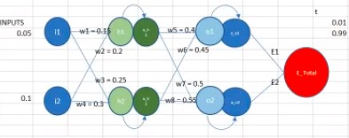
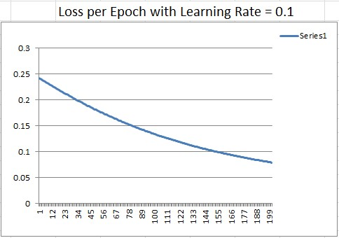
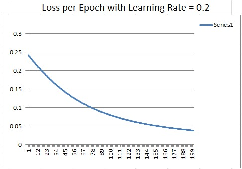
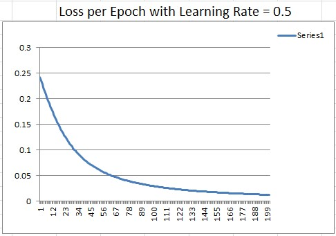
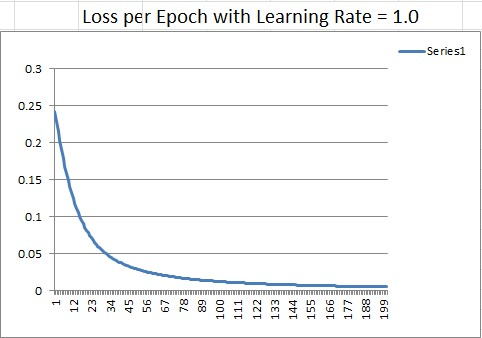
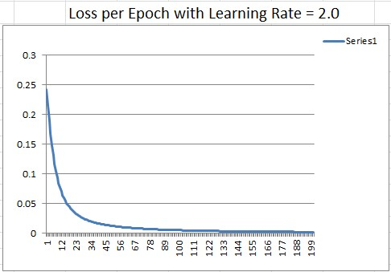

# PART 1 - Excel Sheet Showing Back Propagation
Below is an example Neural Network that will used to build an excel sheet with all the calculations for forwrd pass and back propagation for each epoch.

It is a single hidden layer neural net with two inputs i1 & i2 and two outputs o1 and o2. Hidden layer values are represented by h1, h2, a_h1 and a_h2. Sigmoid activation function is used to demonstrate the calculations. All variables with 'a_' prefix (like a1_h1, h1_o1 etc) represent the result after applying activation function. E1 and E1 represent the errors for each outputs, we use mean squared error loss function.

## Following are the formulas for calculating values for hidden layer:

h1 = w1 * i1 + w2 * i2

h2 = w3 * i1 + w4 * i2

a_h1 = sigmoid(h1) = 1/(1 + exp(-h1))

a_h2 = sigmoid(h2) = 1/(1 + exp(-h2))

## Following are the formulas for calculating values for output layer:

o1 = w5 * a_h1 + w6 * a_h2

o2 = w7 * a_h1 + w8 * a_h2

a_o1 = sigmoid(o1) = 1/(1 + exp(-o1))

a_o2 = sigmoid(o2) = 1/(1 + exp(-o2))

Error calculation formulas are:

E1 = 0.5 * (t1 - a_o1)^2

E2 = 0.5 * (t2 - a_o2)^2

E_total = E1 + E2

## Calculating Derivates

For calculating the derivative of the toal error with respect to each of the weights (w1, w2, ...w8) we use chain rule and build it up one step at a time. Following we show an example formula for the last 5 weights that are closer to output layer.

\delta E_t / \delta w5 = (a_o1 - t1) * a_o1 * (1 - a_o1) * a_h1

\delta E_t / \delta w6 = (a_o1 - t1) * a_o1 * (1 - a_o1) * a_h2

\delta E_t / \delta w7 = (a_o1 - t2) * a_o2 * (1 - a_o2) * a_h1

\delta E_t / \delta w8 = (a_o1 - t2) * a_o2 * (1 - a_o2) * a_h2

For calculating derivates with respect to the beginning weights, following formulas are used.

\delta E_t / \delta w1 = \delta E_t / \delta a_h1  * a_h1 * (1 - a_h1) * i1

\delta E_t / \delta w2 = \delta E_t / \delta a_h1  * a_h1 * (1 - a_h1) * i2

\delta E_t / \delta w3 = \delta E_t / \delta a_h2  * a_h2 * (1 - a_h2) * i1

\delta E_t / \delta w4 = \delta E_t / \delta a_h2  * a_h2 * (1 - a_h2) * i2

Where the derivative of total error with respect to a_h1 is calculated with following formulae.

\delta E1 / \delta a_h1 = (a_o1 - t1) * a_o1 * (1 - a_o1) * w5

\delta E2 / \delta a_h1 = (a_o2 - t2) * a_o2 * (1 - a_o2) * w7

\delta E_t / \delta a_h1 = \delta E1 / \delta a_h1 + \delta E2 / \delta a_h1

And the derivative of total error with respect to a_h2 is calculated with following formulae.

\delta E1 / \delta a_h2 = (a_o2 - t2) * a_o2 * (1 - a_o2) * w6

\delta E2 / \delta a_h2 = (a_o1 - t1) * a_o1 * (1 - a_o1) * w8

\delta E_t / \delta a_h2 = \delta E1 / \delta a_h2 + \delta E2 / \delta a_h2

## LR impact on Total Error

Impact of changing the learning rate to [0.1, 0.2, 0.5, 0.8, 1.0, 2.0] is shown in following graphs.

# Part 2 - NN for Mnist - 99.4% accurcy with less than 20K parameters and less than 20 Epochs

With the  having 18K parameters and training for 15 Epochs, we could achieve an accuracy of 99.4%.

The network uses combination of 3x3 convolutions, batch normalization, 1x1 convolutions, dropout (Just at the last layer) and Max pooling layers to keep the paramters low and achieve the result. ReLu activation function is used at all the layers except at the final layer. Global Average Pooling (GAP) function is used at the end to a tensor of 10x1x1 and the output is passed thru log_softmax function after removing the unit dimensions with squeeze function.

Same network was changed from GAP function at the end to a Fully connected layer and similar results were achieved.  shows the changes and the result of the training. With the FC layer, the parameters increased to 19.5K but still with in the 20K limit set for the assignment.
